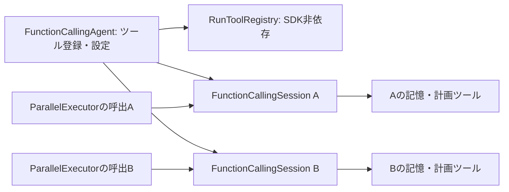

# RF-03 第2段階：FCAの実行状態とツール参照の分離

更新：2026-08-28。対象：Azure VMの`Shannon-dev`。状態：dev実装、本番未反映。
前基点：`a209969e`。第1段階は[実行順序・中断管理](refactor-execution-coordination.md)。
最新の検証結果・コミットはNotion 08の15節を参照する。

## 修正前に再現した問題

VM devの実FCA・実ツールを、外部サービスのみmockして同時実行した。

- AのLLM応答を待つ間にBが開始すると、Aのupdate-planがBのchannelId/taskIdで通知された。
- ParallelExecutorがBのMemoryAgentを共有ツールへ注入し、Aのrecall-memoryがBの参照を使用した。

共有FCA内にはfeedback、思考履歴、LoopDetector、plan通知、nudge、blackboard accessorもあった。
キュー順序だけでは、別会話や緊急割込みでの可変状態共有を解消できない。

## 所有者と契約

- `FunctionCallingAgent`は登録と設定だけを保持する。`run()`は毎回新しいsessionを生成する。SubTaskExecutor等の既存のrun呼出もこの経路を通る。
- `FunctionCallingSession`は1回だけ実行できる。思考・feedback・plan/nudge・LoopDetector・publisher・tool executor・モデル関連の実行状態を所有する。実行中/完了後の再利用は拒否する。
- 終了時に一時状態を解放し、遅れて届いたfeedback・plan通知・blackboardの再設定は閉じたsessionへ蓄積しない。
- `RunToolRegistry`はツール登録のsnapshotを生成する。後から登録したツールは既に作成済みのsessionへ入り込まない。入力/返却配列を外部で変えてもcatalog/session配列を変更しない。
- `recall-memory`、`save-memory`、`update-plan`、`plan-craft`は`createForRun()`で新規生成する。catalog側のmemory、blackboard、送信先、過去のplan、bot参照をコピーしない。
- `setContext`/`setMemoryAgent`/`setBlackboard`/`setBot`を持つツールはfactory必須。未対応の登録、元オブジェクトを返すfactory、名前を変えるfactoryを拒否する。
- 状態のないツールや共有サービスは再利用する。任意のツールが安全だと自動証明する仕組みではなく、新しい状態付きツールの登録時にもレビューが必要。
- ParallelExecutorは呼出ごとにsessionを作り、そのsessionだけへMemoryAgentとblackboardを設定する。旧処理のcleanupは新しいsessionへ触れない。
- MemoryAgentへはgraphが明示した`requestEnvelope`を渡す。taskId不一致/未指定は拒否する。metadataから本人情報を復元したり、空の本人・会話IDを暗黙に合成したりしない。identityの値とtags配列をsnapshot化し、後から呼出元が本人を変えても既存MemoryAgentを向け直さない。
- ShannonExecutor側も実行ごとに状態付きツールを生成し、`_call`の直接呼出から`invoke(input, { signal })`に変更する。

## 中断と通知

初期記憶待ち、LLM応答後、思考要約後、streamの各文境界で中断を確認する。
キャンセルを通常のtaskエラー結果として成功経路へ返さない。update-planのDiscord通知はplatformがDiscordの場合だけに限定し、WebのconversationIdをDiscordのchannelIdとして送らない。

これは送信済みの内容や開始済みの外部作用を取り消す仕組みではない。すべてのtool/補助処理が中断に応答する保証もない。

## 検証

VM devで`bash scripts/with-dev-node.sh`を使い、`npm run test:offline -w backend`、`test:auth -w frontend`、`check:foundation -w backend`、`check:access-integration -w backend`、common/frontend build、native probeを実行する。
backend全体のビルドは`tsc --noCheck --skipLibCheck`であり、完全型検査とは区別する。

- `fcaSessionIsolation.test.ts`：実FCA/ThinkingManager/ToolExecutor/状態付きツールとmock外部サービス。2件の失敗再現、思考・feedback・plan・blackboard交錯、catalog隔離、one-shot、save/plan-craft参照、Web→Discord誤通知防止、canonical envelope、緊急割込み、stream/初期記憶待ちの中断を検証。
- `requestExecutionCoordinator.test.ts`：既存の順序・割込みに加え、factoryの拒否条件、atomic登録、状態付きツールの新規生成を検証。
- `graphCancellation.test.ts`：実LangGraphとmockのFCA/Parallel/ShannonExecutorを通し、requestEnvelopeの受け渡し、実行別tool生成、invokeへのsignal、native中断時にfallbackしないことを検証。
- 既存lifecycleと自己改変保護テストも更新。session本体・memoryツール・計画ツールを編集禁止対象に追加する。

## 今回の対象外と次の単位

**2026-08-30 更新:** Web planning/post_message/realtime は session 必須。Discord outbound gateway の `postMessage` は voice session 限定。Minebot UI POST は envelope / bot memory context 必須。

**DBの記憶検索・保存の権限分離は MemoryPort / TaskEpisodeMemory で scope 必須化済み。** 旧 MemoryAgent は削除済み。MemoryWriteEvent の古い pending ジョブは残る。全チャネルの宛先認可は会話イベント主要経路で完了。Discord outbound gateway の legacy emoji 経路は configured guild + voice session で fail-closed。

次は Identity–Binding–Audience UI、Firebase UID 対応付け、旧 pending ジョブの運用方針。scope不明は既定拒否し、2利用者・DM→公開・同名利用者・別guild/worldのfixtureで検索前の制限を検証する。

Web の planning/openai/monitoring 会話通知は session ルーティング済み。status/skill/schedule は運用 telemetry として global broadcast を維持。Discordの直接投稿ツールの引数認可や、ゲームbot/routineの共有サービスも別課題。public chat/SSEの停止とconsole管理者限定を維持する。

簡素化FCAの記憶ツールは、専用MemoryAgentの初期化契約が未完成なため未初期化のままの場合がある。以前の別sessionの参照を流用して有効化しない。

Firebase/Discordの資格情報分離・UIDレビュー・費用枠・実機/復旧確認は別工程。Halcyonを操作せず、新Botも作成しない。prodは読み取りのみ、env/DBは変更せず、起動ロックを維持する。

## 移行・復旧

登録先には`FunctionCallingAgent`、実行中のfeedbackやblackboard設定先には`createSession()`の戻り値を使う。共有agentへの`getTools`/`addFeedback`/`setBlackboardAccessor`呼出は残さない。

DB/schema/envの移行なし。必要時は対象コミットをレビューしてrevertする。大きなFCA差分の大半は既存ループの`FunctionCallingSession.ts`への移動で、一括書き直しではない。GitHub push・本番切替は今回行わない。

Notion：https://www.notion.so/3ca1e84762888170816ee73f25c40ce3
