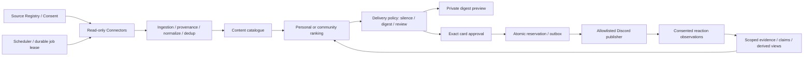

# Shannon Radar — 現行基盤への統合設計

更新：2026-08-28。状態：RAD-1Aに続き、RAD-1Bの本人限定catalog・Mongo CAS・設定/撤回/preview HTTP部品をdevへ実装。最新は11節。**APIはserver未登録。MVP全体、本人画面、定期収集、実配信、記憶管理UIは未完成・未稼働。本番未反映。**

入力資料：ユーザー指定 `shannon/outputs/shannon-radar-architecture.md`（Shannon Radar Architecture）。現行の設計・判断は[Notion 08](https://www.notion.so/3ca1e84762888170816ee73f25c40ce3)、優先順位は[Notion 02](https://www.notion.so/3ca1e84762888153bb4dcf4714a92fb8)に集約する。

## 1. 目的と非目標

Shannonの主用途を、少数の有用な情報を届ける静かな個人／コミュニティ情報Botとする。創作・開発へ勝手に口出しする相棒、タスク管理者、公開Discordで会話を始めるキャラクターにはしない。

- 個人：推しVTuberの新着・ライブ予定、学術的に面白い動画、重要ニュース、天気、創作の糧になる新規性のある情報。まず非通知の個人ダイジェスト。
- コミュニティ：スプラ、ポケモン、任天堂、謎解き、TRPG、その他ゲーム。Shannon用に許可したチャンネルへ機械的な情報カード。
- 自発投稿にメンション、DM、問いかけ、返信催促、自動スレッドを付けない。会話は明示的に呼ばれた時だけ。返信用の既存personaをカードへ混ぜない。
- 👀／🎮／📌／🙅は任意の反応。無反応は欠損であり嫌悪の証拠にしない。リアクションの説明を求めない。
- 既存の会話・Minecraft・音声をこの変更で一括削除・起動変更しない。旧自発処理の停止設定と利用経路は本番切替前に別途レビューする。

## 2. 調査した既存実装との接点

| 実装 | 利用する土台 | そのまま再利用しない部分 |
|---|---|---|
| RF-03 execution/session | request所有、中断、状態分離 | 長時間ジョブの耐障害queueではない |
| scope付きmemory/person port | 本人・会話・出典、CAS、忘却tombstone | 一人一枚profile、推測traits、scopeなし旧人物記憶は復旧しない |
| 第6段階Discord port | 会話返信の宛先・権限検証、送信完了を待つ考え方 | 自発投稿のために偽のrequest/userを作らない。会話権限はRadar投稿権限ではない |
| `services/youtube/client.ts` | video情報の既存知見 | コメント返信、live chat投稿、広いOAuthと同居。Radarは別のread-only adapter |
| `services/scheduler/client.ts` | 既存scheduleの所在 | cronがEventBusへ直接publish。Radarのtimerから直接投稿・会話生成しない |
| Web管理console | サーバー側認証・管理者操作の土台 | 管理者権限を一般メンバーの私的記憶閲覧権限にしない。本人専用経路が必要 |
| MongoDB | 既存運用・復元検証済みの保存基盤 | 通常DBへの無計画なmigration、旧processing再実行、全キャッシュ横断検索をしない |

調査時prodは95426bb。第5段階fccf4d88、第6段階12978584はdevでコミット・保全済み。第6段階429テスト合格。prodは変更せずdev起動ロックを維持した。

## 3. サービス境界と依存方向

当面は同じモノレポのモジュラーモノリス。`backend/src/modules/radar` はSDK・I/O・時計・環境変数・会話graphに依存しない。adapterはmoduleに依存し、moduleからDiscord/Google/Mongo/EventBusへimportしない。必要になればconnector/enrichment/delivery workerを別プロセスへ出す。全機能のマイクロサービス化は不要。

| 境界 | 所有するもの | 持たせないもの |
|---|---|---|
| Connector Gateway | ソース登録、取得cursor、quota/backoff、OAuth参照、出典、入力サイズ制限 | 投稿権限、人物推測、会話graph |
| Content Pipeline | URL正規化、同一更新/同じ話題のcluster、事実検証状態、有効期限 | private情報をpublicへ昇格する推測 |
| Ranking | audience内候補、明示的興味、品質/新規性/鮮度の点数と内部理由 | timer、Discord SDK、送信、通知予算の消費 |
| Delivery Policy | 個人/チャンネル予算、quiet hours、focus、重複、digest/沈黙判断 | 推薦スコアを権限と見なすこと |
| Publication / Outbox | 承認内容、許可宛先、lease/予約、送信結果・不明状態 | 会話ツールやLLMからの任意チャンネル指定 |
| Evidence / Claims | 本人・同意・出典・時刻・版・撤回の管理 | 主記憶としてのprofile文、年齢/性別等の推測 |
| Control UI/API | 本人の記憶管理、ソース/頻度、カード承認、監査閲覧 | 公開Web broadcastに個人データを載せること |
| Device Gateway（後続） | 同一delivery IDの端末選択、静かな表示 | 端末ごとの重複push、無断の音声/映像送信 |

## 4. データモデル案

新しいcollectionはadapter実装時に明示migrationで作る。以下は設計であり、今回DBへ作成していない。

| レコード | 主なフィールド／一意性 |
|---|---|
| SourceSubscription | id, owner/audienceKey, sourceKind, approved host/channel/calendar IDs, enabled, scopes, cursor, poll interval, quota, revision。秘密はcredentialRefのみ |
| RawItem / EvidenceEvent | id, sourceId, externalId, sourceRevision, fetchedAt, observedAt, payloadRef, visibility, consentVersion, status。source+external+revisionで冪等 |
| ContentItem | id/revision, clusterId, sourceId/URL, sourceKind, publishedAt/fetchedAt/expiresAt, event time, topic IDs, short fact, verification, risk flags, visibility |
| PersonClaim | subjectId, predicate, value/entityId, context, evidenceIds, declared/observed/inferred, confidence, firstObservedAt, lastConfirmedAt, expiresAt, visibilityScope, revision, status |
| CommunityPreference | guild/channel, topicId, explicit configuration or aggregate evidence, consent snapshot, time window, confidence。個人IDや非公開理由を公開カードに出さない |
| ProfileView | subject/audience, source claim IDs+revisions, generatedAt/expiresAt。削除して再生成できる派生物。主記憶ではない |
| Recommendation | candidate IDs/revisions, audienceKey, rankingVersion, internal reason codes, source IDs, createdAt。私的理由はその本人のみ |
| DeliveryDecision / Draft | candidate/source revisions, policy revision, decision+reason, deliveryId, exact audience, content snapshot/hash, expiry |
| PublicationApproval | approver, exact reviewed snapshot/hash, destination, policy revision, approvedAt/expiresAt/revoked。編集・宛先変更で失効 |
| DeliveryOutbox | idempotency key, audience/attention account, item cluster, delivery/channel/device, lease owner/version/until, attempts, status, Discord messageId, uncertainAt |
| Consent / Revocation / Audit | authenticated actor, subject/audience, action, entity IDs/revisions, reason code, occurredAt。本文・秘密・個人理由は一般監査に出さない |

### 人物記憶の移行

第5段階`ScopedPersonStatement`は本人の発言の引用であり、「引用が真実である」「引用内の人物が本人である」とは断定しない。これをprofileへまとめて旧traitsを復活させない。後続adapterは出典記録として接続し、claimは別ID/版/根拠を持つ。

- MVPは本人の明示的なtopic設定と同意済みリアクションの観測だけ。年齢・性別・健康・政治・関係性などの推測は禁止。MVPのclaim predicateを非センシティブな趣味/作品/イベントに限定し、センシティブ値そのものを保存対象にしない。
- 将来も1回の👀を恒久的な「好き」にしない。🙅はそのtopicの表示を減らす意思であり、人格/嫌悪全般には広げない。取消反応はretract。無反応は学習データにしない。
- 各メンバーの閲覧/訂正/削除/共有範囲は本人の認証と結びつける。Discord管理者だからという理由で私的なclaimを読めない。識別は表示名でなくplatform ID。別platform統合は本人の明示リンクが必要。
- 初期はprivate。community集計への利用には別の同意と集計閾値を設ける。公開カードには私的データ由来の理由も含めない。集計閾値・保持期間は未決、少人数で個人を推定できる場合は明示的なコミュニティ設定だけ使う。
- append-onlyな「記録の履歴」と「個人本文を永続保存すること」を区別する。削除/撤回ではraw payload、claim、view、embedding/cache、推薦/draft、未送信queueを失効・消去する。本文を持たない最小tombstoneのみ残して遅延再投入を拒否する。
- 送信済みDiscordカード/バックアップ/第三者複製まで即時消去できるとは約束しない。自Bot投稿の削除可否、バックアップの保持期間・復元時の撤回再適用を明示する。**この全面撤回は未実装であり、学習の本稼働前の必須条件。**

## 5. 外部ソースのMVP

| ソース | 初手 | 外部接続前の条件 |
|---|---|---|
| YouTube | 指定channelのuploads一覧・動画metadata、既知videoのlive予定。新着から段階導入 | 対象channel一覧、read-only/API quota、取得量/間隔。既存reply/live-chat権限を再利用しない。新着一覧だけで全予定配信を網羅すると約束しない |
| 天気 | 本人指定の地域・時間帯、出典/発表時刻付きの要点 | provider/地域粒度/出典表記/利用条件。現在地を勝手に取得せずcommunityへ個人の場所を公開しない |
| Calendar | ownerが選んだcalendarの必要なイベント、またはbusy時間だけ | OAuth本人同意、calendar allowlist、必要最小scope。参加者/説明/機密URLを既定で保存しない。全件をDiscordへ出さない |
| Web | 選択した公式サイト/RSS、学術・ニュースソース | host/path allowlist、redirect毎の検査、private IP/loopback/metadata endpoint遮断、上限/timeout、robots/利用条件、引用量。ページ内命令をツール命令として扱わない |
| X（後続） | 本人が許可するlist/account/queryの読み取り | 契約・quota/費用・権限の確認後。MVP未接続、投稿/いいね等を起動しない |

API一次資料（2026-08-28確認）：[YouTube playlistItems.list](https://developers.google.com/youtube/v3/docs/playlistItems/list)、[videos.list](https://developers.google.com/youtube/v3/docs/videos/list)、[video liveStreamingDetails](https://developers.google.com/youtube/v3/docs/videos)、[Calendar OAuth scopes](https://developers.google.com/workspace/calendar/api/auth)。Calendarは利用目的によりfreebusyまたは必要なread-only scopeを選ぶ。プロバイダ選定・OAuth発行・API実行を今回済ませた意味ではない。

## 6. 配信ポリシーと承認

スコアが高くても送らないことが正常。timerは候補だけを作る。初期値は停止、空のsource/destination allowlist、送信予算0。運用開始後の提案は個人digest1日1回・最大3件、Discord1日最大2枚・1時間1枚以下だが、**これは提案値で未設定・未承認**。quiet hours/timezone、カテゴリ偏り、最低間隔をユーザー設定にする。緊急扱いでこれらを自動回避しない。

1. audienceの許可集合を決めてから候補検索・順位付けする。私的calendarは本人以外不可。
2. source/期限/確認状態/重複/スコアを検査する。個人はdigest下書き、コミュニティはquiet/focus/budget検査後も承認待ち。
3. 承認画面は送るカードそのもの、宛先、出典、有効期限を表示する。why-thisの私的理由は分離。承認者本人をサーバー側で認証・認可する。
4. outboxへ入れる前・送る直前に最新source同意、policy、承認、内容、expiry、宛先権限、投稿履歴/予約を再検査する。
5. audience/日付単位のattention ledgerにcluster/deliveryの予約をCASで原子的に登録する。複数worker/端末が同じ古いcountを読んでも上限を超えない。standalone Mongoでは跨collection transactionを前提にせず、単一ledger documentの予約とjob作成の回復を設計・競合試験する。
6. 期限付きleaseを取ったdelivery workerだけがallowlistのguild/channelへ送る。会話EventBusやrequest返信portを迂回路にしない。mentionsを無効化、通知を抑制、thread/DMを作らない。送信完了を待つ。
7. Discord応答が不明なら`uncertain`として予約を保持し、自動再送しない。確認・監査後に解決する。exactly-once配信は保証しない。失敗と未送信の区別が不明なleaseを単に解放しない。

カードは題名・短い事実・メタデータ・出典URL・任意タグだけ。自由なLLM会話文や「どう思う？」を足さない。今回のformatterは疑問符拒否/Markdown・@処理を行うが、**命令口調/事実性/非公開理由を意味的に完全検出するものではない**。人間のカード承認と入力source検証が必要。

## 7. RAD-0で実装したものと限界

`modules/radar/content.ts`：MVP source種別、audience/期限/出典の確認、明示的topicの順位付け、cluster重複除去、不変snapshot。

`deliveryPolicy.ts`：rankと独立したsilence/digest/approval_required判断。個人digestは非通知の**プレビュー**なのでquiet/focus中にも組み立てられるが、通知許可/予算消費ではない。実送信には別の予約・再検査が必要。

`drafts.ts`：静かなカード/私的digest、承認対象の正確なsnapshot、内容/宛先/版/期限/承認取消の整合確認。`matchesApproval`は認証ではなく、trusted repositoryから得た承認の照合関数。一般入力の自己申告approvalを信頼してはならない。

`feedback.ts`：本人＋同じaudienceの有効な同意がある観測のみを写像。reactionなしはnull、removeはretract。trait/claim推測もDB保存も行わない。

SDK非依存型検査・import境界・自己改善からの変更禁止へ追加。既存server/bootstrap/schedulerには登録していない。実connector、durable outbox/予算予約、送信SDK、監査DB、本人管理UI、リアクション購読、推論/多様性最適化は未実装。URL検査は表示用でありSSRF防御の実装完了ではない。

VM devでRAD-0専用65テスト、backend476＋frontend18＝494テスト、foundation/記憶/対象accessの通常型検査、common/frontend build・backend noCheck変換、native probe、dev記憶read-only監査が成功。全backendの通常型検査ではない。prod95426bb clean・769ファイル/削除1パス・PID4318/開始時刻7761不変、health正常。外部API/DB書込み/実投稿/本体起動なし。最終検証原本と差分bundleは `radar-foundation-20260828` の保全記録を参照。

## 8. 段階的ロードマップと完了条件

| 段階 | 実装単位 | 完了条件 |
|---|---|---|
| RAD-0 今回 | SDK非依存の候補/順位/配信判断/承認下書き/反応契約 | モックでscope漏れ、期限切れ、静音、予算0、承認使い回し、無反応の負学習を拒否。既存回帰・prod不変 |
| RAD-1 個人MVP | SourceRegistry、YouTube/Web/天気/Calendar read-only adapters、provenance/dedup、手動実行→lease付き収集、本人digest preview UI | fixture→限定read-only検証。private calendar分離。ソース/地域/日程/費用/保持の設定。出典・why-this・明示feedback、毎回少数件 |
| RAD-2 Discord MVP | owner承認UI、許可guild/channel、durable ledger/outbox、quiet card publisher、監査 | 専用test bot＋テストチャンネル。複数worker予約、期限失効、revocation、送信不明/再起動を試験。人が承認したカードだけ送る。会話を求めない |
| RAD-3 記憶管理・学習 | evidence→claim→view、本人の閲覧/訂正/削除/共有、リアクション観測と撤回、community集計 | 全派生物とpending jobの撤回、遅延replay、本人/他人、同意取消の試験。管理UIと撤回が揃うまで自動人物学習を有効化しない |
| RAD-4 静かな自動運用 | 明示許可内の自動Discord、ライブ通知、X read、探索/多様性、端末間dedup | 少数の承認運用で有用性と通知量を確認後。ownerが自動化を許可。閾値/quiet/budget、mute/rollback、課金上限を確認 |
| RAD-5 デバイス | Aether/端末gateway、身体cue、呼ばれた時のvoice | 同一delivery二重通知なし、local mute/wake、音声映像のprivacy mode、個別承認 |

優先順は安全基盤→RAD-1→RAD-2→RAD-3。従来の「相棒人格・自発会話→会議→Minecraft」の優先順を置き換える。会話履歴/音声/旧EventBusの安全課題はRF-03継続として切り出し、Radarをその未認可経路へ接続しない。期限・費用・実送信先は未定。

## 9. 運用・検証・ロールバック

- DB製品：原案のPostgreSQL/pgvector/Redisは将来の選択肢。現VMはMongoDB運用・単体構成・空き容量に制約がある。最初はMongo adapterと単一document CASを第一候補にし、索引/retention/lease/復元を検証する。移行が有利になった時に別ADRと移行計画を作る。
- Raw payloadは必要最小の抜粋と期限。全文/動画/画像の大量保存をしない。高容量ならobject storageを別途選定、秘密と私的calendarを公開保管しない。
- 監査はsource IDs、選定/沈黙理由、policy版、承認者、配信結果、記憶書込/撤回を追えること。raw会話/秘密を一般ログやNotionへ出さない。audit書込み失敗なら投稿しない。
- 成功指標：保存/閲覧の明示反応、通知量、同一情報の重複、mute/「減らす」、出典/理由の追跡率、未承認送信0。無反応を嫌悪と数えない。人間同士の自然な会話が起きてもBotから返信を要求しない。
- fixture検証後、専用主体・allowlist・予算を決めてread-only→承認投稿の順。prodへは別工程で反映。devロックを回避しない。既存サービスを全部起動してRadarだけ試すことをしない。
- 今回は未登録moduleなのでランタイム動作は変えない。後続ではfeature停止→新規予約停止→processing/uncertainを監査→worker停止の順。既存データ削除や自動再送をrollbackに含めない。

未決：追跡YouTube/Webソース、天気地域/提供者、Calendarと必要scope、個人digestの表示先/時刻、Shannon投稿チャンネルID/承認者、test bot、通知上限、API費用、同意UIと保持期間。これらが未決でもモック実装は継続できるが、ライブ取得/送信の包括許可ではない。

## 10. RAD-1A — 公開フィードの読み取りと出典付きプレビュー

状態：VM devで実装・モック検証。新しいAPI・scheduler・serverへ登録しておらず、実ソース設定/ネットワーク取得/定期稼働/投稿なし。RAD-1全体の完成ではない。

### 実装した経路

`FeedRegistryPort` → `FeedCollector` → `PublicFeedConnector` → `SafeFeedHttp` → RSS 2.0/Atom metadata → `FeedRecord` → RAD-0 rank/policy → 本人用digest preview。

- `modules/radar/sourceRegistry.ts`：source ID/版、owner audience、enabled、同意期限、明示したchannel/feed URL・記事host・topic、最大件数、保持時間の契約。sourceなし/停止/期限切れ/別audience/未知のsource kindは拒否。設定を必要フィールドだけsnapshotする。
- `services/radar/jsonFeedRegistry.ts`：移行期のread-only設定adapter。明示pathのprivate regular JSONファイル（他者の権限bitなし、上限64KiB/100件）だけ読む。symlink/重複ID＋audience/壊れた設定は拒否し、エラーへ本文を出さない。既定path・自動登録・書込APIなし。毎回読み直し、取得中のatomic replaceによる無効化も検出。**実際のソース設定ファイルは作成していない。** Mongoの正本collection/管理UIへ移行する際は同じportを使う。このJSON adapterを永続queue/監査DBの代わりにしない。
- `safeFeedHttp.ts`：GETのみ、HTTPS既定port、credential/cookieなし、redirect・retry・圧縮展開なし。DNSの全IPv4応答を検査し、RFC1918/loopback/link-local/予約域/metadata・Azure platform VIPを拒否。検査済みIPを実socket lookupに固定してDNS再解決を防ぎ、元hostnameのTLS検証/SNIを維持する。agentを共有しない。
- DNSを含む全体8秒、header8KiB、body256KiB、XML content-type/UTF-8、abort/不完全bodyを検査する。IPv6-onlyサイト・redirect必須サイトは初期段階では非対応。これは既存の汎用URL取得ツールを保護した変更ではなく、Radar専用経路。
- `feedConnector.ts`：YouTubeは指定channelの公式Atom feed URLからvideo/channel IDを照合し、動画リンクをIDから構築。Webは指定したqueryなしの公開feed URLだけ、記事linkも明示hostの絶対HTTPSに限定。utm queryを除き、認証/署名を示すqueryやfragment・別hostを拒否。RSS 2.0/Atomのみ、DTD/entity declarationを拒否、最大100entryを走査し最大20候補。HTMLページ/相対link/RDFは未対応。
- 保存候補はtitle/link/published/updated/fetchedAtと出典（entity key、正規化metadataのversion hash、source版・取得URL）。fetchedAtは取得完了時に採取。本文・description・画像・生XMLは結果へ保持しない。IDは同じsource/audience/entity/versionで決定的、同じURLはcluster重複除去。**これはDB永続化や日をまたぐ履歴dedupではない。** 更新版は別の不変snapshot IDで、各ContentItemのrevisionは1。
- source_checkedは「登録feedにそのmetadataが掲載された」意味に限定。linked articleの事実検証、ライブ予定、公式性・新規性の保証ではない。factはその掲載を述べる定型文。noveltyは0、qualityは中立の0.5で置き、過去履歴やsource reviewなしに高評価しない。実データを見てrank閾値を決めるまで配信を有効化しない。
- `collectFeed.ts`：取得前後にregistryを照合し、disabled/期限切れ/宛先・内容変更は版番号が同じでも結果を破棄。中断後の遅延結果や別sourceのconnector出力を拒否する。出典/版/audience/outcome/countの監査DTOを返し、rawエラーや記事本文を含めない。現在のprivate audienceと一致する結果だけをdigest previewへ渡す。

### 検証と保護

VM devで新規112テスト＋RAD-0の65テストが合格。通常のfoundation/access-integration型検査にも今回の全Radar serviceを追加。JSON registryはVMの一時ファイルで読取、権限・symlink・atomic置換・失効を検証し、fixtureを削除して終了。HTTP/DNSはfakeで、外部通信なし。自己改善からの`services/radar/`編集も禁止した。

全回帰・build・prod不変と最終SHAの検証原本はVM保全先 `radar-ingestion-20260828/result.json`、コミット・増分bundleは同保全先に保存する。全backendの通常型検査と実HTTP/TLS接続が成功したという意味ではない。

### 次の工程・限界

1. sourceの本人管理/認証UI/API、永続catalogと日をまたぐ重複/更新/撤回、監査保存、ポーリング間隔・費用/回数予約・lease/recoveryを実装する。現状は単発読取の部品で、並行workerの取得回数上限を保証しない。
2. 天気provider/地域とCalendar provider/必要scopeが未確定のため、今回のsource validatorはweather/calendarを受け付けない。これらをWeb feedと偽って登録しない。Calendarは本人だけの別adapter、天気は個人の位置情報を公開しないadapterを追加する。
3. 推しchannel/公式Web sourcesを選び、本人の非通知preview UIへつなぐ。設定の有効化/変更権限は入口の認証で保証し、registryやsnapshot照合だけで認証済みと扱わない。
4. collector終了後に同意が撤回される可能性は残る。保存/画面返却/投稿の直前にも最新設定と権限を再検査する。実publisherは未接続なので今回の結果が外部投稿へ進むことはない。
5. YouTubeの全ライブ予定をfeedだけで網羅すると約束しない。必要なら許可されたData API read-only取得を後続追加する。一般的なニュース要約・事実検証・多様性/負の明示設定も未実装。

今回確認した一次資料：[YouTube公式のAtom feed形式とchannel/video ID](https://developers.google.com/youtube/v3/guides/push_notifications)、[Cheerio XML parsing](https://cheerio.js.org/docs/advanced/configuring-cheerio/)、[Node HTTPS options](https://nodejs.org/api/https.html)。実装はVMのNode22.21.1・Cheerio1.0.0・既存型定義で検証し、依存更新は行っていない。

## 11. RAD-1B — 本人限定catalog・更新/撤回・HTTPプレビュー

状態：devの独立した部品として実装。通常DBやserver/bootstrapへ登録しない。取得は内部の明示呼出だけで、HTTPにcollect/refresh/publish操作を用意しない。実ソース設定、Firebase/外部HTTP、定期ジョブ、Discord投稿、本体起動は今回の範囲外。UIは後続。

### 責務とデータ境界

- `modules/radar/catalog.ts`：SDK非依存のowner aggregate、source entry、短い変更履歴、repository port、最新metadataのmerge。FeedRecord契約をsourceRegistryへ移し、HTTP/parserやMongoの実装型へ依存しない。
- `services/radar/personalRadar.ts`：本人の設定/撤回、collector→catalog保存、private previewのuse case。AccessServiceが検証したcontextだけを受け、profile:readと有効期限を確認する。ownerはFirebase projectId＋UIDから決定的hashを作る。表示名/email/adminフラグで他人を選ばず、Discord subjectや旧JSON sourceを自動リンクしない。このhashは仮名化であり匿名化ではない。
- `mongoPersonalCatalog.ts`：明示的に渡したDBの新collection `radarpersonalcatalogs`。connectionを自作せず、constructorでI/O・index・migrationを実行しない。既存Mongooseのnative driver型を使い、依存追加なし。
- `routes/radarRoutes.ts`：GET sources/preview、PUT source、DELETE sourceの登録関数。Bearer認証・利用許可・本人scope、no-store、Vary Authorization、厳密な入力key、body上限を設定。URL queryでのowner指定や未知fieldを拒否。通常ユーザーも自分だけ管理でき、管理者が他人を見る特権はない。serverへは未登録。

### 単一文書CASを採った理由

ownerごとに設定・catalog・直近監査を1文書へまとめる。_idとownerで検索し、全体revisionを期待値にしたreplaceOneで変更する。初回はinsertOneのみで、既存ownerへのupsertはしない。source自身のrevisionは設定変更時、全体revisionは設定/収集/撤回時に進む。異なるソースの同時変更も競合する保守的な設計で、409後に無条件で上書き再試行しない。

これにより単体Mongoで跨collection transactionを要求せず、内容と変更履歴が片方だけ保存される状態を避ける。[MongoDBの単一文書atomicityと期待値filter](https://www.mongodb.com/docs/manual/core/write-operations-atomicity/)を参照。queue/outbox/予算ledgerまで同じ文書へ無制限に詰め込む方針ではない。性能/運用規模/クラッシュ復旧は別途検証する。

初期の安全上限はownerあたり設定10件、削除済みを含むsource ID32件、sourceあたり最新20件、直近監査64件、文書1MiB。設定APIの同意期限は最大30日。これはライブ運用の通知頻度や保存同意を決定した意味ではない。墓標上限に達した後の整理、全体のユーザー数/容量上限は未実装。

### 取得・更新・撤回

1. 再認証callbackで現在の本人/利用許可を確認し、catalog版をsnapshotする。JSONを経由せず、そのowner文書をregistry portとして既存FeedCollectorへ渡す。
2. source設定・同意を取得前後に確認。戻り値の出典hash、source/版、公開URL・host、時刻、期限を保存境界でも再検査。既知metadataだけを再構築し、自由なfact・raw payload・未知fieldを保存しない。記事の真偽/公式性/新規性を検証した意味ではない。
3. 保存直前に同じ本人を再認証し、期限・キャンセルを再確認して最初のcatalog版でCAS。取得中の設定変更/撤回や別collectorの保存があれば拒否。並行取得回数自体を制限するlease/予算予約はまだない。
4. entity keyごとに最新versionへ置換。同じversionは重複保存せず保持期限を延長しない。古いupstream updatedAtによる巻き戻しを拒否。feedから項目が消えただけでは削除と推定しない。日をまたぐ再読でも保持範囲内の同じ版は1件だが、20件/期限を超えた履歴の永久dedupや送信済み判定ではない。
5. 設定変更はenabledの切替を含め既存catalogを空にする。DELETEはlocator/host/topic等の設定と全metadataを消し、source IDの墓標だけ残す。同じIDの再作成・遅延取得による復活を拒否。新IDでの本人の再登録は別操作として許される。

### 本人用previewと権限再確認

現在有効なsourceに属するmetadataだけでrank→delivery policy→静かなカードを組み、最大3件の非通知previewを返す。理由は本人がsourceに指定したtopicとの一致・score・source版として本人だけに返す。topicを人物の推定traitへ保存しない。個別の重み設定/学習/高度な推薦品質は未実装。

use caseの最終catalog再読、HTTP返却直前の再認証・catalog再照合と期限を確認する。変更が挟まれば古いカードを返さず409。返却にはvalidUntilを付ける。最終チェック直後の撤回や既に返したブラウザ内容を瞬時に消せる保証ではない。画面側の再取得/ログアウト時消去/期限表示は後続で必須。

再認証callbackは必須のサーバー部品で、自己申告actorを返す実装を本番へ接続しない。APIは同じBearer tokenをAccessServiceで再検証する。開始済みDB write・ネットワーク応答を取消できるわけではなく、応答不明時の自動再試行や削除済みIDの再利用はしない。

### 検証方法と未完部分

VM devのunit/隔離Express fixtureでは、本人/別project/他人/admin分離、未知入力、再認証と失効、CAS競合、取得中/保存直前の撤回、取消・同意期限切れ、出典改ざん、保持/更新/上限/previewを検証する。DNS/HTTP/Firebaseはfake。実HTTPの認証成功やUI完了の証明ではない。

`scripts/probe-radar-catalog-mongo.cjs --isolated-fixture`はVM devとロック、専用loopback37029の新しい空DB `shannon_radar_fixture`を要求する。実Mongoの8並行初回保存・8並行取得、CAS勝者、repo再生成後の読取、本人分離、設定/撤回競合、本文消去・再投入拒否を確認する。起動/停止は別のfixture管理スクリプトで行い、通常27017へ接続しない。TTL/index/旧collection移行なし。

監査は直近64件の設定/収集/撤回と件数だけであり、全選定理由・失敗試行・全期間の監査ログではない。期限切れは読取から除外するが、物理消去は次の収集/設定変更/削除まで遅れる。全派生物/人物記憶/バックアップ/投稿先への全面撤回、purge worker、取得回数予約・lease/recovery・outbox、本人画面、weather/calendarは未完。これらとFirebase/UID・専用Bot等の条件を満たすまでライブ有効化しない。

検証・コミット原本：VM保全先 `radar-catalog-20260828`。ローカル記録 `SHANNON_RADAR_CATALOG_2026-08-28.md`。全backendはnoCheck変換と対象部品の通常型検査を区別する。prod read-only・起動ロック維持。通常DBの新collection作成、実データ移行、env変更・push・本番反映なし。

## 12. RAD-1C — 本人用設定画面・期限付きdigest preview

状態：VM devで実装・隔離fixture検証。`/radar`に画面を追加したが、RAD-1B APIのserver/bootstrap登録は行っていない。通常アプリ/認証/DBのライブ疎通成功ではない。実ソース設定・取得、scheduler、Discord投稿、env変更、本体起動、prod反映は行わない。

### 画面と状態管理の責務

- `features/radar/radarClient.ts`は既存の認証付きfetchへ依存を注入する境界。固定のsources/preview/PUT/DELETEだけを使う。owner/監査等をDTOへ持ち込まず、URL・既知field・上限・非通知カードを検証する。応答サイズは宣言長と読取後の文字数で制限するもので、streamingによるメモリ上限制御ではない。
- `radarController.ts`は画面sessionごとに生成する。読取/保存/表示中/失効/終了を管理し、世代番号とAbortSignalで古い結果を無視する。設定とpreviewのcatalog版、各source版・同意・記事hostを照合する。更新時は先に旧データと入力draftを消去し、CAS成功後も返された版以上で読み戻す。409は競合、応答不明は結果不明として表示し、自動で更新を再試行しない。
- `RadarDashboard`と`SourceEditor`は表示と入力だけ。最大3カードと選定理由、出典リンク、source一覧、追加/変更/削除確認を用意。新規同意は未選択、同意期限は最大30日、weather/calendarは選択不可。削除は同じIDの再利用不可と説明する。通知・収集・会話を始める操作や自動ポーリングはない。
- `RadarPage`はAuthGuardの内側、AgentProviderの外側。閲覧だけで操作用WebSocketを起動しない。非管理者のログイン後の既定画面はRadar、管理者は従来のコンソールを維持し、明示したRadarへの戻り先だけを許す。

### ブラウザ上の本人境界と失効

AuthSessionはFirebase project/UID/token callback世代をsession keyへ含め、検証済みtokenの期限を持つ。authorizedFetchとRadarPageはUIDだけでなく現在のUser objectが同じか確認する。同じUIDでログアウト/再ログインしても古い画面を使い回さない。fetch開始前/応答後とJSON読取後のcontrollerで現在sessionを確認する。

preview HTTP返却に`servedAt`を追加し、`validUntil - servedAt`から読取全体の単調時計経過時間を引く。表示時間は最大60秒。端末時計のずれで表示を延長しない。タイマーだけでなく操作時にも期限を確認する。タブ非表示・window blur・pagehide・BFCache復帰・ログアウト・session変更は画面データとdraftを消し、復帰時は手動再読を要求する。Radar内容をlocal/session storageへ保存しない。

これはサーバーの撤回を全ブラウザへ即時通知する仕組みではない。ブラウザ停止中の描画消去時刻の絶対保証や、スクリーンショット/既に開いた外部ページの消去はできない。60秒で未保存の入力も失う保守的な仕様であり、長い編集の使い勝手は今後改善する。Firebaseの実token更新/期限/再ログインE2Eは未検証。共有資格情報のまま検証を強行しない。

### 検証と運用制限

frontendの既存authテストを拡張し、DTO・URL・固定API・本人切替・中断・期限・版競合・二重保存・結果不明・読み戻し・描画を検証する。backendの既存HTTPテストにservedAt契約を追加。全体の結果はVM保全先`radar-ui-20260828/result.json`を正本とする。

`scripts/serve-radar-ui-fixture.cjs --isolated-fixture`はVM devのパスとロックを確認し、envDir:falseで専用静的画面をbuild、loopback127.0.0.1:13002だけで配信する。実RAD-1B route/serviceと架空認証・in-memory CAS repositoryを接続し、3つの架空Web sourceをseedする。通常Mongo、Firebase、connector、Shannon本体には接続しない。試験後はfixtureと転送用SSHを停止する。fixture entryはtests配下に置き、実アプリに架空データfallbackを入れない。

ブラウザでカード表示、設定保存後の旧カード失効、別ownerの空画面、遅延中のログアウト、短縮期限、409、API未登録時の安全な空表示、390px幅での横はみ出しなし、追加フォームの同意未選択、削除確認/キャンセルを確認する。削除確定は既存unit/HTTP試験が担当し、ブラウザでは未実行。架空認証での画面確認を実Firebase認証検証と呼ばない。

次は取得回数の原子的予約・lease/recovery、物理expiry purge/監査拡充を優先する。その後weather/calendar adapter、認証条件を満たしたdev統合、個人previewの実ソース評価、承認付きDiscordへ進む。全backendの通常型検査、実認証・通常DB migration、通知予算/outbox/全面撤回は未完。API未登録時は「準備中」と表示し、有効化のための迂回をしない。

参考：[React useSyncExternalStore](https://react.dev/reference/react/useSyncExternalStore)、[Vite envDir](https://vite.dev/config/shared-options#envdir)。依存追加・更新なし。ローカル記録`SHANNON_RADAR_UI_2026-08-28.md`。

## 13. RAD-1D — 取得回数予約・lease回復・本人限定expiry purge

2026-08-29。devの内部部品として実装。HTTP/server/schedulerへの登録・通常DBへの適用・実ソース取得・本体起動・投稿は行わない。通知予算と取得回数の予算を混同しない。

### 境界と初期の選択

`modules/radar/acquisition.ts`はSDK非依存のpolicy/state/leaseと純粋な遷移を定義する。`PersonalRadarService`が認証・取得・catalog保存を調停し、`MongoPersonalCatalog`がowner文書単位のCASを行う。既存catalogにoptionalなversion:1のacquisition stateを追加し、設定/metadata/予算/直近監査を一緒に確定する。別collection間の原子性や新規transaction基盤を要求しない。

これは無制限なqueue/outboxをowner文書へ足す設計ではない。保持するのは直近24時間の開始時刻（最大256件）、owner全体で1つのlease、固定policy、最後に確認した時刻だけ。source10件/墓標込み32ID/各20metadata、監査64件、文書1MiBの既存上限を維持する。reservationsも全体revisionを進めるため、画面の読み戻しと競合した場合は409になる。

### 回数の予約と失敗時の扱い

1. `collect`は現在の本人確認に加え、明示的なserver policyを必要とする。既定値なしは取得不可。policyはmaxPer24Hours（1〜256）、minimumIntervalMs（0〜24時間）、leaseMs（100ms〜60秒）。これは技術上限で、実際の運用頻度/同意/費用を決めたものではない。試験の間隔0を本番推奨値と扱わない。
2. 同じownerの全sourceで回数を共有する。開始時刻からの直近24時間窓と最小間隔で判定し、日付が変わっても一斉リセットしない。設定変更・全source削除・別ID作成でも予算を保持する。他人のownerとは分離する。
3. 最新catalog版を期待値に、予約時刻と一意のattempt ID/source版/期限をCAS保存する。同意・認証期限より長いleaseを作らない。失敗/キャンセル/HTTP前のクラッシュでも1回分として数え、返金しない。保存応答が不明ならconnectorへ進まず、残ったleaseを回復対象とする。
4. Mongoはprimaryから読み、writeConcern majority＋j:trueでジャーナルへの書込み完了も要求する。write concern errorは成功扱いしない。これは実際の停電/ディスク喪失/replica failoverを検証した保証ではない。今回の実Mongo試験は単体4.4・journal有効の隔離fixtureのみ。
5. policyを予約文書へ固定し、異なる設定のworker、壊れたstate、時計の巻き戻りは拒否する。実運用でのpolicy変更・全体の費用上限・provider横断予算・公平なsource別スケジューリングは後続。自動的なpolicy migrationやstate初期化を行わない。

### 実行期限と回復

予約後も版とlease ID/期限を読み直し、取得前後・保存前に照合する。connectorへAbortSignalを伝え、期限または取消で待機を終了する。取消を無視するconnectorの遅延応答にも、保存へ進む継続処理を残さない。元sourceの設定・同意、保存直前の再認証を引き続き必須とする。

成功時はmetadataと成功監査、lease解放を同じCASで確定する。失敗時はそのattempt IDがまだ所有するleaseだけを、別の最新CASで解放し固定outcomeを記録する。後から戻った旧処理が新しいleaseや設定を消してはならない。失敗後の解放が競合/DBエラーになった場合はleaseを残し、期限後の明示回復に任せる。rawエラー・本文・URLを監査へ追加しない。

`maintain(context, expectedRevision, reauthorize)`は現在の本人のownerだけを対象に、期限切れleaseを回復する。回復は取得を開始せず、使用済み回数を戻さない。その後の新しい取得は再度認証/同意/回数を確認して予約する。既存のsource設定/削除済みID/新しいleaseを古いsnapshotで上書きしない。

保証するのは論理的な予約と保存の排他。停止したVM上の古いsocketや、取消を無視する外部処理の物理的な同時実行を全世界で止める保証ではない。DB write/認証の進行中I/Oを取り消す保証や、チェック直後の時刻変化をDB commitと完全同時にする保証もない。新しい予約/回復で版が進めば、旧版での保存は失敗する。自動job queue、worker supervisor、再認証情報の安全な受渡し、全owner回復は未実装。

### 期限切れ候補の物理消去

同じ`maintain`で、保持期限が切れたmetadataと、停止/同意期限切れsourceのmetadataをowner文書から除去する。設定と墓標、使用済み回数は残す。owner文書自体のTTL削除は行わない。内容を消した件数と、leaseを回復した場合のattempt IDだけを直近監査に記録する。変更なしは再認証と版の確認だけを行い、書き込みを増やさない。

このpurgeは明示的な本人単位の部品。全ownerの走査、定期実行、DBバックアップ/全派生記憶/投稿済みカード/外部画面の消去ではない。失効を読取から隠すだけだったRAD-1Bに、明示呼出での物理消去を追加した段階である。実データに適用する前には対象・保持方針・運用主体の確認が必要。

### 検証・導入・未完

既存`radarPersonal.test.ts`を拡張し、policy境界、24時間窓、clock rollback、再設定/削除をまたぐ上限、8並行→connector1回、予約応答不明、取消/期限、旧処理の遅延、失敗解放の競合、再読後回復、本人限定purge、最終再認証直後の失効を検証する。従来の改ざん/撤回/本人分離試験は維持し、予約とoutcomeが加わったrevisionを反映する。

既存Mongo probeは新しい予約契約に更新。loopback37029の新しい空DBで、8並行設定・取得・回復・purge、repository再生成後の予算保持、回復後も回数上限で拒否、他人の文書不変、metadata消去・墓標保持を検証する。正常停止までを証跡へ含める。通常27017へ書き込まず、過去のfixture/証跡を再利用しない。今回の保全先は`radar-acquisition-20260829`、ローカル記録は`SHANNON_RADAR_ACQUISITION_2026-08-29.md`。

導入にはjournal利用可否、同じpolicy/コードのworkerだけが接続すること、既存stateを保持する移行・rollbackを確認する。旧RAD-1C以前の実行コードは未知のacquisition fieldを落とし得るため、新旧の混在運用をしない。依存更新・DB index/TTL追加なし。全backendの通常型検査は引き続き未完で、対象通常型検査とnoCheck変換を区別する。

次は監査の保持/失敗試行記録とworker運用の設計、weather/calendarのread-only adapter、実認証条件を満たしたdev統合。本人画面/APIは未稼働、実ソース/費用/地域/Calendar scope/専用Bot/Discord承認先の未決事項を飛ばして接続しない。

参考：[MongoDBの単一文書atomicity](https://www.mongodb.com/docs/manual/core/write-operations-atomicity/)、[write concernとjournal ACK](https://www.mongodb.com/docs/manual/reference/write-concern/)。

## 14. RAD-1E — 本人限定の単発実行・監査保持

2026-08-29。`RadarSessionRunner`と期限付き監査の内部部品をdevへ実装。既存API factoryに本人用の読み取り専用`GET /api/radar/audit`を追加したが、server/bootstrapへの登録はしない。取得/maintenanceのHTTP、scheduler、全owner走査、実Firebase/実ソース接続は未実装・未有効化。MVPへ向けた、ログイン中の明示取得の土台である。

### 実行主体と取得の責務

- runnerはAccessService・PersonalRadarService・connectorをcompositionで受け取り、アプリ起動/環境変数/DB接続/投稿に依存しない。入力は`expectedRevision`と最大3つの異なる`sourceIds`だけ。ownerやRequestContext、権限・取得policyを外部入力から作らない。全選択sourceを事前確認し、現在の本人だけを対象に順番に処理する。
- サーバーが受け取ったtokenをその呼出のメモリ内でだけAccessServiceへ渡す。初回・取得前・予約/保存前・結果返却前に再検証し、同じprojectId＋UIDと利用許可を確認する。token/UID/emailをjob・catalog・監査・結果へ保存しない。検証済みcontextをprofile:readのみに狭め、実行開始から30秒を超えて延長しない。
- これはtokenの再検証であり、ユーザーへパスワード再入力を要求するstep-up認証でも、Firebase SDK自体の実接続検証でもない。失効確認の実効性は注入するIdentityVerifier/AccessUserRepositoryに依存する。実compositionでは既存AccessServiceを使用し、contextを捏造する独自auth callbackへ差し替えない。
- catalogを読む時だけでなく、各取得の予約CASにも期待版を渡す。確認後にsourceが編集された場合は、新しい設定を勝手に取得せず中止する。途中のエラー/競合/権限変更/中断/予算不足は残りのsourceを実行せず、再試行も回復も行わない。既に成功したsourceは取り消さない。失敗応答は全体のロールバックを意味せず、本人による読み戻しが必要。
- 実行全体の30秒期限とAbortSignalを使う。遅い認証の応答から後続処理を始めない。connectorへ取消を伝え、遅延した内容は保存しない。進行中DB書込みを物理取消する保証はないため、応答不明時は予約/結果の読み戻しを要する。期限後も最小限のlease失敗精算が完了する場合があり、永久に止まらないDB自体をこのrunnerが終了させる保証はない。

### 監査は「直近・期限付き」であることを明示する

`modules/radar/audit.ts`が形式検証・保持・返却projectionを担当する。owner文書内の連続するrevisionの末尾だけを扱い、capacityは従来通り64件。7日を技術上の保持上限とし、件数上限でそれより早く削除され得る。運用で7日間すべて保持する約束や、改ざん不可能な長期監査ではない。ライブの同意/保持期間の確定は別途必要。

監査には固定action/outcome、attempt ID、source ID、時刻、版、件数だけを許し、本文・出典URL・token・raw errorを含めない。形式・連続版・時刻順に異常があれば拒否する。古い64件上限で消えた範囲は復元しない。応答の`omittedThroughRevision`で欠落の末尾版を示し、`completeFromRevisionOne`を併記する。空の旧履歴を完全な履歴と呼ばない。

期限を過ぎたイベントは読取から除外する。次のowner文書更新または明示的`maintain`で物理消去する。監査だけが期限切れでもmaintainはCASで一度だけ処理し、自身の実行記録を追加する。設定/墓標/取得回数は消さず、他ownerを操作しない。無人purge/DB backup/外部出力先/全派生データの消去は未完であり、7日で必ずDBから消える保証ではない。

本人用audit APIは再認証・owner固定・返却直前の版/認証期限確認・no-storeを要求する。`validUntil`は認証期限・保持期限・最大60秒の最小値。sources/previewと同じserver未登録の部品で、監査UIはまだない。audit応答を画面へ接続するときは既存session/期限消去の仕組みを適用する。raw監査や全owner閲覧を管理者へ公開しない。

### 無人workerは別の権限で設計する

本実装のtokenをキューへ保存したり、失効したユーザーcontextを再生成して定期ジョブを動かしてはならない。将来のworkerは、本人が明示した委譲grant（owner、source ID/版、許可operation、期限、撤回epoch）を専用repositoryへ保存し、認証済みworkload identityと現在のgrant/利用許可を照合する。grant IDは認証情報の代わりではない。毎回の取得前と保存前に権限を確認し、grant撤回と予約/保存の競合を同じowner CASまたは相応の原子性で解決する。

全owner purgeは取得権限と分け、内容読取/新規取得/設定変更を許さないmaintenance専用主体・件数上限・監査・cursor・停止回復を設計する。jobにtokenや内容を入れず、識別子と期待版のみを持たせる。outbox/配送承認と通知予算も取得回数とは分離する。これらは設計案であり、worker登録や委譲grantは未実装。

### 検証・後続

既存`radarPersonal.test.ts`を拡張。AccessService本体＋架空verifier/usersで再認証・owner/project切替・失効・取消/タイムアウト・入力snapshot・設定競合・応答不明・途中成功・8並行実行を検証する。監査容量/期限/欠落範囲・本人分離・不正データ・返却期限・HTTPを検証する。

新しいjournal有効の隔離Mongo37029 fixtureで既存CAS/回復/purgeに加え、runnerの8並行→1取得、再読後の監査期限消去と欠落表示、他人のデータ不変を確認する。実Firebase/実HTTP/通常DB/本体を使わない。結果原本は保全先`radar-session-20260829`、ローカル記録は`SHANNON_RADAR_SESSION_2026-08-29.md`。

次はweather/calendar専用のread-only契約・adapterとモック試験、本人画面への明示取得/監査表示の接続。認証・source/地域/Calendar scope/費用枠を確定した後に限定dev統合し、無人workerは委譲grantの実装と検証後、Discordは承認/送信先/専用Botの条件を満たした別段階へ進む。旧版との混在では保持方針が逆戻りするため、同じ実装/policyのみを使用しrollbackを検証する。全backend通常型検査は未完、prod未反映・ロック維持。
